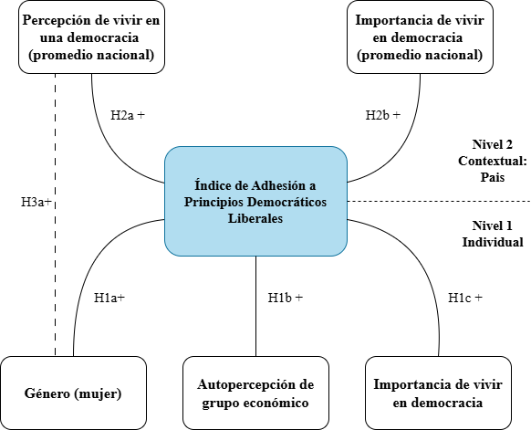
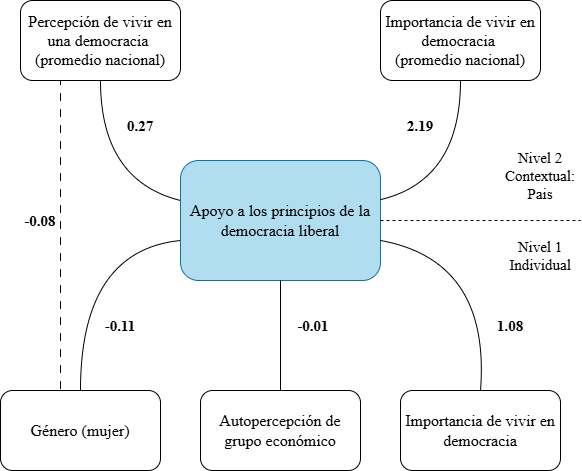

---
format:
  revealjs:
    title-slide: false
    theme: multinivel.scss
    incremental: true 
    slideNumber: true
    auto-stretch: false
    transition: fade
    transition-speed: slow
    scrollable: true
    scrollOverflow: true           
    css: estilos.css 
    self-contained: true
editor: source
---

# 

```{r librerias, echo=FALSE, warning=FALSE, message=FALSE, collapse=TRUE}

#| label: load-packages
#| include: false

pacman::p_load(
  haven, car, corrplot, dplyr, stargazer, lme4, texreg,
  reghelper, psych, sjPlot, ggplot2, ggeffects, lattice, kableExtra, sjmisc, equatiomatic, knitr, htmltools, ggrepel)
options(scipen = 999)
rm(list = ls())
```

```{r datos, echo=FALSE, warning=FALSE, message=FALSE}

load(file="procesamiento/data/data.RData")

```

:::::: columns
::: {.column width="20%"}
:::

:::: {.column .column-right width="80%"}
# **Adhesión a principios democráticos liberales: entre las percepciones individuales y los contextos nacionales**

------------------------------------------------------------------------

**Martina Gallardo, Cristóbal Unda y Diego Vicuña**

::: {.red2 .medium}
**Análisis de datos multinivel - 2025**

**Departamento de Sociología, Universidad de Chile**
:::

Santiago, 26 de Junio de 2025
::::

[Github repo](link%20al%20repo)
::::::

::: notes
Aquí mis notas
:::

# Introducción

-   Durante la última década, la democracia liberal ha enfrentado múltiples tensiones. Aunque se mantienen formalmente instituciones como elecciones libres o división de poderes, ha crecido la insatisfacción ciudadana con su funcionamiento (Wike, Silver & Castillo, 2019). Esta paradoja genera una pregunta clave: ¿realmente la ciudadanía sigue adhiriendo a los principios democráticos liberales?

------------------------------------------------------------------------

-   **Variable Independiente:**

    > Índice de Percepción sobre Principios de Democracia Liberal (0-30)

-   **Variables asociadas Nivel 1:**

    > Género (mujer), Autopercepción de grupo económico e Importancia de vivir en democracia

-   **Variables asociadas Nivel 2:**

    > Promedio nacional de importancia atribuida a vivir en democracia y promedio nacional del índice de respaldo a los principios democráticos

# Antecedentes

-   Inglehart y Welzel (2005a; 2005b) sostienen que los valores de autoexpresión y autonomía individual son fundamentales para el sostenimiento de los regímenes democráticos, ya que se fortalecen en contextos donde los recursos materiales están asegurados y existe una cultura que promueve la libertad individual. Además, plantean que los climas democráticos nacionales —como la percepción colectiva de vivir en una democracia— refuerzan estas disposiciones individuales, articulando así una dinámica entre condiciones estructurales y orientaciones subjetivas que favorece el respaldo a los principios liberales.

-   Alexander y Welzel (2011) encontraron que las mujeres suelen mostrar mayor apoyo a la equidad y los derechos civiles. No obstante, su influencia concreta sobre el respaldo a la democracia liberal todavía es debatida.

##  {data-background-color="#5f5758"}

::: {.center .middle}
[¿Cómo inciden las percepciones individuales y los climas democráticos nacionales en el respaldo ciudadano a los principios de la democracia liberal?]{style="font-size: 250%;"}
:::

# Hipótesis:

## Nivel 1:

$H_1a$: Las mujeres presentan un mayor respaldo a los principios de la democracia liberal que los hombres.

$H_1b$: Las personas que valoran positivamente vivir en democracia presentan un mayor respaldo a los principios de la democracia liberal.

$H_1c$: Las personas que se perciben en una mejor situación económica presentan un mayor respaldo a los principios de la democracia liberal.

## Nivel 2

$H_2a$: Los países en los que la ciudadanía percibe que viven en una democracia presentan un mayor respaldo promedio a los principios de la democracia liberal.

$H_2b$: Los países donde las personas valoran más vivir en democracia presentan un mayor respaldo promedio a los principios de la democracia liberal.

------------------------------------------------------------------------

**Interacción entre niveles**

$H3a$: El efecto positivo del género (a favor de las mujeres) sobre el respaldo a los principios de la democracia liberal es más intenso a medida que el país sea percibido más democrático.

{fig-align="center" width="600" height="400"}

# Metodología {data-background-color="#5f5758"}

## Datos

Se utilizó la base de datos de la **séptima ola del World Values Survey (2017–2022)**, compuesta por **88.207 casos** en **66 países**. La estructura jerárquica de la base (individuos anidados en países) permite el uso de modelos multinivel. Se eliminaron casos con datos faltantes y se construyó un índice compuesto que captura percepciones sobre tres principios fundamentales de la democracia liberal: soberanía popular, protección de derechos civiles e igualdad de género.

## Variables

##### Estadísticos descriptivos univariados nivel 1

```{r tbl-descriptivos-nivel1, echo=FALSE, warning=FALSE, message=FALSE}

datos_limpios <- datos %>%
  haven::zap_labels() %>%  # Elimina atributos de etiquetas
  ungroup()

datos_limpios %>% select(indice_dem, país, grp_econ, imp_dem, mujer) %>% 
  ungroup() %>%
  sjmisc::descr(show = c("label","range", "mean", "sd", "NA.prc", "n"))%>%
  kable(digits =2, "markdown", caption = "Variables nivel 1")

```

##### Estadisticos descriptivos univariados nivel 2

```{r tbl-descriptivos-nivel2, echo=FALSE, warning=FALSE, message=FALSE }
agg_datos <- datos %>% group_by(país) %>% summarise_all(mean) %>% as.data.frame()
agg_datos %>% select(cuan_dem, prom_imp_dem) %>%
  sjmisc::descr(show = c("label", "range", "mean", "sd", "NA.prc", "n")) %>%
  kable(., digits = 2, "markdown", caption = "Variables nivel 2")
```

## Métodos

Se estimaron modelos multinivel con interceptos aleatorios y, posteriormente, con pendientes aleatorias para evaluar efectos contextuales. Se reporta el ICC, los coeficientes de regresión, errores estándar y varianzas explicadas. El análisis se realizó con software estadístico compatible con modelamiento multinivel, siguiendo recomendaciones metodológicas de Goldstein (1995) y Finch et al. (2014).

Se estimaron un total de 5 modelos.

------------------------------------------------------------------------

## Modelo de nivel 1: incluye predictores individuales.

$$
\text{Y}_{ij} \;=\; \gamma_{00}
+ \gamma_{01}\,(\text{grp_econ}_{ij})
+ \gamma_{02}\,(\text{mujer}_{ij})
+ \gamma_{03}\,(\text{prom_imp_dem}_{ij})
+ u_{0\text{j}}
+ e_{ij}
$$

## Modelo de nivel 2: incluye predictores contextuales.

$$
\text{Y}_{ij} \;=\; \gamma_{00}
+ \gamma_{01}\,(\text{cuan_dem}_{j})
+ \gamma_{02}\,(\text{prom_imp_dem}_{j})
+ u_{0\text{j}}
+ e_{ij}
$$

## Modelo 3 multinivel:

$$
\text{Y}_{ij} \;=\; \gamma_{00}
+ \gamma_{10}\,(\text{grp_econ}_{ij})
+ \gamma_{20}\,(\text{mujer}_{ij})
+ \gamma_{30}\,(\text{imp_dem}_{ij})
+ \gamma_{01}\,(\text{cuan_dem}_{j})
+ \gamma_{02}\,(\text{prom_imp_dem}_{j})
+ u_{0\text{j}}
+ e_{ij}
$$

## Modelo 4 con pendiente aleatoria:

:::: {style="font-size:85%"}
::: {style="overflow-x: auto; white-space: nowrap;"}
$$
\text{Y}_{ij} \;=\; \gamma_{00}
+ \gamma_{10}\,(\text{grp_econ}_{ij})
+ \gamma_{20}\,(\text{mujer}_{ij})
+ \gamma_{30}\,(\text{imp_dem}_{ij})
+ \gamma_{01}\,(\text{cuan_dem}_{j})
+ \gamma_{02}\,(\text{prom_imp_dem}_{j})
+ u_{0\text{j}}
+ u_{\text{1j}}(\text{imp_dem}_{ij})
+ e_{ij}
$$
:::
::::

## Modelo 5 de interacción:

:::: {style="font-size:85%"}
::: {style="overflow-x: auto; white-space: nowrap;"}
$$
\text{Y}_{ij} \;=\; \gamma_{00}
+ \gamma_{10}\,(\text{grp_econ}_{ij})
+ \gamma_{20}\,(\text{mujer}_{ij})
+ \gamma_{30}\,(\text{imp_dem}_{ij})
+ \gamma_{01}\,(\text{cuan_dem}_{j})
+ \gamma_{02}\,(\text{prom_imp_dem}_{j})
+ \gamma_{21}\,(\text{mujer}_{ij}⋅\text{cuan_dem}_{j})
+ u_{0\text{j}}
+ u_{\text{1j}}(\text{mujer}_{ij})
+ e
$$
:::
::::

# Resultados {data-background-color="#5f5758"}

```{r echo=FALSE, warning=FALSE, message=FALSE, results='hide'  }
dat_scat= datos %>% group_by(país) %>% select(cuan_dem, indice_dem) %>% na.omit() %>% summarise_all(mean)
names(dat_scat)
```

## Gráfico 1

### Relación de promedio de percepción sobre cuan democratico es un país con Índice de Percepción sobre Principios de la Democracia Liberal

```{r  echo=FALSE, warning=FALSE, message=FALSE }
sjPlot::plot_scatter(dat_scat, cuan_dem,indice_dem,
            dot.labels = to_label(dat_scat$país),
            fit.line = "lm",
            show.ci = TRUE
            )
```

```{r echo=FALSE, warning=FALSE, message=FALSE, results='hide'  }
dat_scat= datos %>% group_by(país) %>% select(prom_imp_dem, indice_dem) %>% na.omit() %>% summarise_all(mean)
names(dat_scat)
```

## Gráfico 2

### Relación de promedio de importancia de vivir en un país democratico con Índice de Percepción sobre Principios de la Democracia Liberal

```{r  echo=FALSE, warning=FALSE, message=FALSE }
sjPlot::plot_scatter(dat_scat, prom_imp_dem,indice_dem,
            dot.labels = to_label(dat_scat$país),
            fit.line = "lm",
            show.ci = TRUE
            )
```

```{r  echo=FALSE, warning=FALSE, message=FALSE }
results_0 <- lmer(indice_dem ~ 1 + (1 | país), data = datos)
ICC  <-reghelper::ICC(results_0) 

results_1 <- lmer(indice_dem ~ 1 + grp_econ + mujer + imp_dem + (1 | país), data = datos)
results_2 <- lmer(indice_dem ~ 1 + cuan_dem + prom_imp_dem + (1 | país), data = datos)
results_3 <- lmer(indice_dem ~ 1 + grp_econ + mujer + imp_dem + cuan_dem + prom_imp_dem + (1 | país), data = datos)

reg_ind <- lm(indice_dem ~ grp_econ + mujer + imp_dem + cuan_dem + prom_imp_dem, data = datos)
reg_agg <- lm(indice_dem ~ grp_econ + mujer + imp_dem + cuan_dem + prom_imp_dem, data = agg_datos)
```

```{r echo=FALSE, warning=FALSE, message=FALSE }
reg_0 <- lmer(indice_dem ~ 1 + (1 | país), data = datos)
reg_1 <- lmer(indice_dem ~ 1 + grp_econ + mujer + imp_dem + cuan_dem + prom_imp_dem + (1 | país), data = datos)
datos$m1 <- predict(reg_1)

datos$imp_dem <- as.numeric(datos$imp_dem)
datos$país <- as.factor(datos$país)

reg2 <- lmer(indice_dem ~ 1 + imp_dem + grp_econ + mujer + cuan_dem + prom_imp_dem + (1 + imp_dem | país), data = datos)


graf1 <- ggpredict(reg_1, terms = c("imp_dem","país [sample=9]"), type="random")

graf2=ggpredict(reg2, terms = c("imp_dem","país [sample=9]"), type="random")


```

```{r echo=FALSE, warning=FALSE, message=FALSE, results='hide'}
datos <- datos %>%                 # CMC (Centering within cluster) nivel 1
  group_by(país) %>%
  mutate(
    mean_grp_econ_pais = mean(grp_econ, na.rm = TRUE),
    grp_econ_cmc         =  grp_econ - mean_grp_econ_pais,
    mean_imp_dem_pais = mean(imp_dem, na.rm = TRUE),
    imp_dem_cmc         =  imp_dem - mean_imp_dem_pais
    
    
  ) %>% ungroup() %>%                        # GMC (Grand mean centering )nivel 2
  mutate(
   cuan_dem_gmc = cuan_dem - mean(cuan_dem, na.rm = TRUE),
  prom_imp_dem_gmc  = prom_imp_dem  - mean(prom_imp_dem,  na.rm = TRUE)
  )

# combinada con centrado
results_3_centrados <- lmer(indice_dem ~ 1 + grp_econ_cmc + mujer + imp_dem_cmc + cuan_dem_gmc + prom_imp_dem_gmc + (1 | país), data = datos)

# individual centrada

results_1_centrado <- lmer(indice_dem ~ 1 + grp_econ_cmc + mujer + imp_dem_cmc + (1 | país), data = datos)


# agregada centrada


results_2_centrado <- lmer(indice_dem ~ 1 + cuan_dem_gmc + prom_imp_dem_gmc + (1 | país), data = datos)

# pendiente aleatoria centrada

reg2_centrada <- lmer(indice_dem ~ 1 + imp_dem_cmc + grp_econ_cmc + mujer + cuan_dem_gmc + prom_imp_dem_gmc + (1 + imp_dem_cmc | país), data = datos)

```

## Modelos centrados e interacción

```{r echo=FALSE, warning=FALSE, message=FALSE, results='hide'}
# interacción entre niveles

pacman::p_load(
  haven, car, corrplot, dplyr, stargazer, lme4, texreg,
  reghelper, psych, sjPlot, ggplot2, ggeffects, lattice, kableExtra, sjmisc)

# multinivel pendiente fija (centrada)
results_3_centrados 

#multinivel pendiente aleatoria (centrada)
reg2_centrada <- lmer(indice_dem ~ 1 + imp_dem_cmc + grp_econ_cmc + mujer + cuan_dem_gmc + prom_imp_dem_gmc + (1 + imp_dem_cmc | país), data = datos, REML=F)

#Modelo con interacciones entre niveles
model_int=lmer(indice_dem ~1 + imp_dem_cmc + grp_econ_cmc + mujer*cuan_dem_gmc + prom_imp_dem_gmc + (1 +  mujer |país), data= datos, REML=F)

```

```{r echo=FALSE, warning=FALSE, message=FALSE}
tab_model(results_0, results_1_centrado, results_2_centrado, results_3_centrados, reg2_centrada, model_int, show.ci = FALSE, show.se = TRUE, dv.labels = c( "Nulo", "Var. Niv. 1 (centrado)", "Var. Niv. 2 (centrado)", "Combinado (centrado)", "Pendiente Aleatoria (centrado)", "Interacción entre niveles"))
```

## Tablas de Devianza {.scrollable-x .smaller}

```{r echo=FALSE, warning=FALSE, message=FALSE}

anova_tabla2 <- anova(results_3_centrados, reg2_centrada)

rownames(anova_tabla2) <- c("Combinado (centrado)", "P.A. Imp_dem")

kable(anova_tabla2, caption = "Tabla de devianza 1: Comparación Pendiente Fija con P.A. Imp_dem") %>%
  kable_styling(full_width = F)

```

```{r echo=FALSE, warning=FALSE, message=FALSE}

anova_tabla3 <- anova(results_3_centrados, model_int)

rownames(anova_tabla3) <- c("Combinado (centrado)", "P.A. Mujer")

kable(anova_tabla3, caption = "Tabla de devianza 2: Comparación Pendiente Fija con P.A. Mujer") %>%
  kable_styling(full_width = F)

```

## Gráfico de pendientes aleatorias

```{r figure2-pendientes_aleatorios, echo=FALSE, warning=FALSE, message=FALSE }


plt <- ggpredict(
  reg2_centrada,
  terms = c("imp_dem_cmc", "país [sample =9]"),
  type  = "random"
)

# Mostrar gráfico
plot(plt) +
  labs(
    title = "Variación por país del efecto de percepción de importancia de la democracia",
    x = "Percepción de importancia de la democracia",
    y = "Índice de percepción de valores de la democracia liberal"
  )

```

## Interacción entre niveles

```{r echo=FALSE, warning=FALSE, message=FALSE}
# grafico interacción
plot_model(model_int, type = "int")
```

## Casos influyentes

```{r echo=FALSE, warning=FALSE, message=FALSE, results='hide'}
# Casos influyentes

pacman::p_load(influence.ME,
               lattice, # dotplot
               dplyr,
               texreg,
               stargazer,
               tidyr
)


datos <- within(datos, país <- unclass(país))

estex.m23 <- influence(results_3_centrados, "país") 

cooks.distance(estex.m23, sort = TRUE)
4/66 # cut point

sigtest(estex.m23, test=-1.96) # no tenemos casos influyentes

```

```{r echo=FALSE, warning=FALSE, message=FALSE }
plot(estex.m23, which="cook",
     cutoff=.06, sort=TRUE,
     xlab="Cooks Distance",
     ylab="país")
```

## Modelo teórico con resultados



# Conclusiones

## Observaciones:

1)  El efecto mujer es relevante, pero varía según el contexto democrático.

2)  P0 de -0,84: A mayor percepción promedio de valores democráticos, menor incidencia de variables exógenas.

3)  Beta prom_imp_dem llama la atención que es mayor en su forma individual imp_dem, lo que indicaría que la percepción del contexto es más influyente que la individual.

## Limitaciones:

1)  El cuestionario se basa en percepciones, lo que puede generar tautologías.

2)  Orden temporal entre variables es debatible (imp_dem → índice_dem).

# Referencias

Alexander, A. C., & Welzel, C. (2011). Empowering women: The role of emancipative beliefs. European Sociological Review, 27(3), 364–384. https://doi.org/10.1093/esr/jcq012

Almond, G. A., & Verba, S. (1963). The Civic Culture: Political Attitudes and Democracy in Five Nations. Princeton University Press.

Ariely, G., & Davidov, E. (2011). Can we rate public support for democracy in a comparable way? Social Indicators Research, 104(2), 271–286. https://doi.org/10.1007/s11205-010-9693-5

Bellino, M. J. (2017). Democracia liberal y democracia participativa: una tensión no resuelta. Revista LyE, (25), 1–20. http://revistas.derecho.uba.ar/index.php/revistalye/article/view/1037

Castro Domingo, P. (2011). Cultura política: una propuesta socio-antropológica de la construcción de sentido en la política. Región y Sociedad, 23(50), 215–247. http://www.redalyc.org/articulo.oa?id=10218443009

Córdoba Gómez, M. (2008). Democracia liberal y democracia participativa: una tensión no resuelta. Andamios, 5(10), 9–32. https://www.scielo.org.mx/scielo.php?script=sci_arttext&pid=S1870-0063200800030000

Finch, W. H., Bolin, J. E., & Kelley, K. (2014). Multilevel modeling using R. CRC Press. https://doi.org/10.1201/b16042

Franetovic, G., & Castillo, J.-C. (2022). Preferences for income redistribution in unequal contexts: Changes in Latin America between 2008 and 2018. Frontiers in Sociology, 7, 806458. https://doi.org/10.3389/fsoc.2022.806458

Goldstein, H. (1995). Multilevel statistical models (2nd ed.). Edward Arnold.

Inglehart, R., & Welzel, C. (2005a). Modernization, cultural change, and democracy: The human development sequence. Cambridge University Press.

Inglehart, R., & Welzel, C. (2005b). Liberalism, postmaterialism, and the growth of freedom. International Review of Sociology, 15(1), 81–108. https://doi.org/10.1080/03906700500038579

Kong, M. (2024). Individual Perspectives on Liberal Democracy: Insights from World Values Survey. International Journal of High School Research, 6(4), 45–60. https://doi.org/10.36838/v6i4.5

Lee, S. K. (2024). Inequality and the Eroding Base of Liberal Democracy. Social Science Research, 113, 103087. https://doi.org/10.1016/j.ssresearch.2024.103087

Offe, C. (2011). Crisis and innovation of liberal democracy: Can deliberation be institutionalised? Czech Sociological Review, 47(3), 447–472. Our World in Data. (2024). Liberal Democracy Index – V-Dem Central Estimate, Population-Weighted. OurWorldInData.org. https://ourworldindata.org/grapher/liberal-democracy-index

Serret, E. (2004). Género y democracia. Revista Venezolana de Estudios de la Mujer, 9(21), 35–47. https://www.redalyc.org/pdf/315/31502103.pdf

Wike, R., Silver, L., & Castillo, A. (2019). Many across the globe are dissatisfied with how democracy is working. Pew Research Center. https://www.pewresearch.org/global/2019/04/29/many-across-the-globe-are-dissatisfied-with-how-democracy-is-working/
